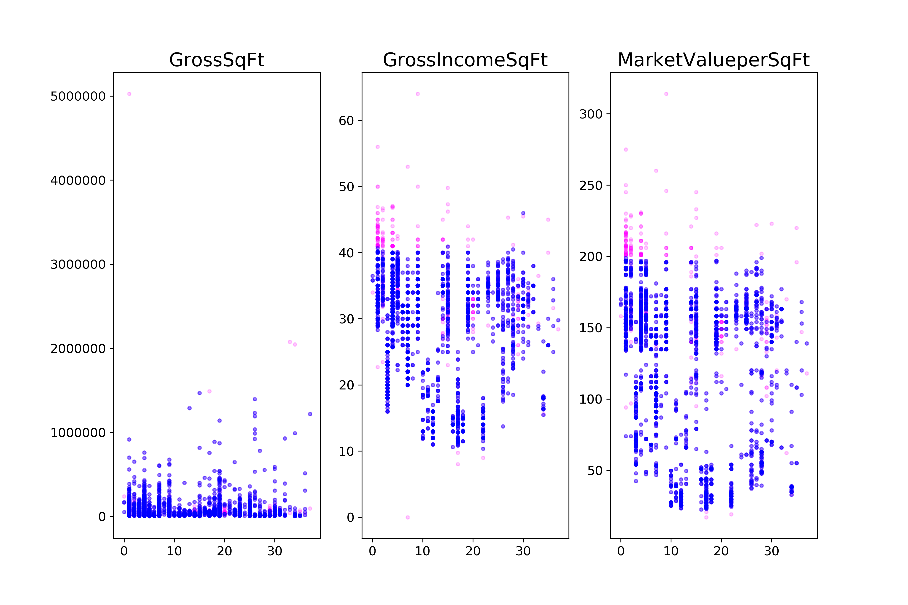
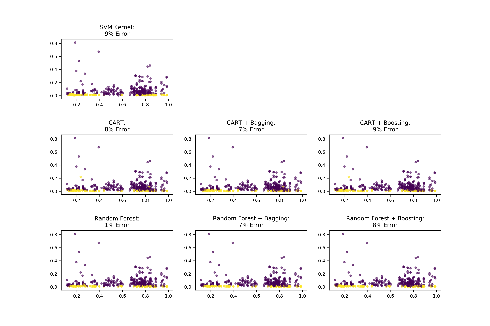

# Classification Comparison
Comparing the following classification methods:
1. SVM (with Kernels)
1. Decision trees (CART)
1. Decision trees (CART) with Bagging
1. Decision trees (CART) with Boosting
1. Random forrest
1. Random forrest with boosting
1. Random forrest without boosting

### Data cleaning

### Classification methods comparison

